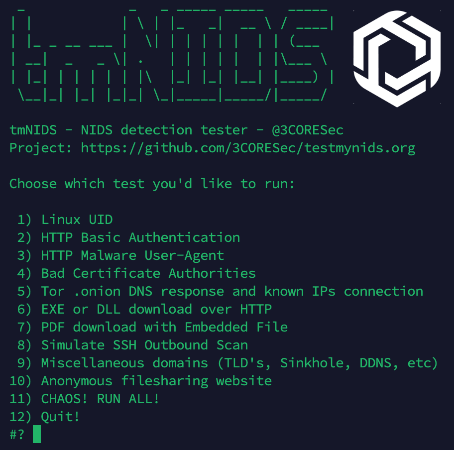

# testmynids.org
A website and framework for testing NIDS detection

## What is it?

A simple project that aims to centralize testing for detection of malicious events by network intrusion detection systems (NIDS). The tests in this project are built against rulesets, not software. Therefor, if you're using ET Open, coverage for these tests will work.

There are two parts to it:

* **A website** - that is used to hold some tests/files. It will also hold sub-domains and DNS records for when testing via DNS is required.
* **A script** - That runs/simulates interaction with the website or with 3rd party websites, meant to be executed on the client for which you want to test coverage of your NIDS sensor.

## Usage

Only requirements are `curl` and `nc`, which should be included in your distribution.

**One-liner to download and execute in interactive mode:** 
```
curl -sSL https://raw.githubusercontent.com/3CORESec/testmynids.org/master/tmNIDS -o /tmp/tmNIDS && chmod +x /tmp/tmNIDS && /tmp/tmNIDS
```

**One-liner to download and execute in script mode:** 
```
curl -sSL https://raw.githubusercontent.com/3CORESec/testmynids.org/master/tmNIDS -o /tmp/tmNIDS && chmod +x /tmp/tmNIDS && /tmp/tmNIDS -h
```
*Tip: Replace the -h with -N (where N is the test you want - see table below) at the end of the one-liner to automatically run the desired test*

### Interactive mode

To run tmNIDS in interactive mode without using the one-liner, download and run the [script](./tmNIDS).

After downloading **tmNIDS** make it executable *(chmod +x tmNIDS)* and run it *(./tmNIDS)* to be presented with the wizard:



### Script mode

To run tmNIDS in script mode without using the one-liner, download and run the [script](./tmNIDS). 

After downloading **tmNIDS** make it executable *(chmod +x tmNIDS)* and run it *(./tmNIDS -h)* to be presented with the script options.

In summary, the usage of `./tmNIDS -N`, where N is the number of the test, will run the designated test for you.

# Included tests

| Test ID | Name                                                              |  Protocols used
|---------|-------------------------------------------------------------------|----------------|
|    1    | Linux UID                                                         | HTTP           |
|    2    | Basic Authentication over clear text                              | HTTP           |
|    3    | Several known malware-related user agents                         | HTTP           |
|    4    | Known bad CA's                                                    | TLS            |
|    5    | Tor .onion response and random Tor nodes connection               | DNS & TLS      |
|    6    | EXE download over HTTP *(from AWS S3)* & Packed Executable        | HTTP           |
|    7    | PDF download over HTTP with Embedded File                         | HTTP           |
|    8    | Simulate an outbound SSH scan                                     | SSH            |
|    9    | Miscellaneous *(TLD's, Sinkhole, DDNS, etc)* domains              | DNS            |
|   10    | Anonymous file sharing website                                     | DNS & TLS      |
|   11    | External IP Address Lookup website | HTTP, DNS & TLS      |
|   12    | URL Shortener | DNS      |
|   13    | Policy Violation - Gaming | HTTP      |
|   99    | CHAOS! Run all tests!                                             | ☝️ ALL         |

## Why? What about _insert_project\_here_?

**Why** - We can check if a NIDS engine is working with a simple rule. In most cases, a ping would do. From that moment on it becomes a matter of rulesets if detection is working or not. The purpose of this project is to quickly verify and showcase detection of as many protocols as possible, while keeping the whole process quick, portable and simple.

**Other projects** - I'm aware that other websites, projects and scripts exist. I created this one because the existing ones were

* lacking features
* no longer supported 
* not portable enough
* too many dependencies

Choose whatever works best for you.

# Feedback

Found this interesting? Have a question/comment/request? Let us know!

Feel free to open an [issue](https://github.com/3CORESec/testmynids.org/issues) or ping us on [Twitter](https://twitter.com/3CORESec). 

[](https://twitter.com/3CORESec)
